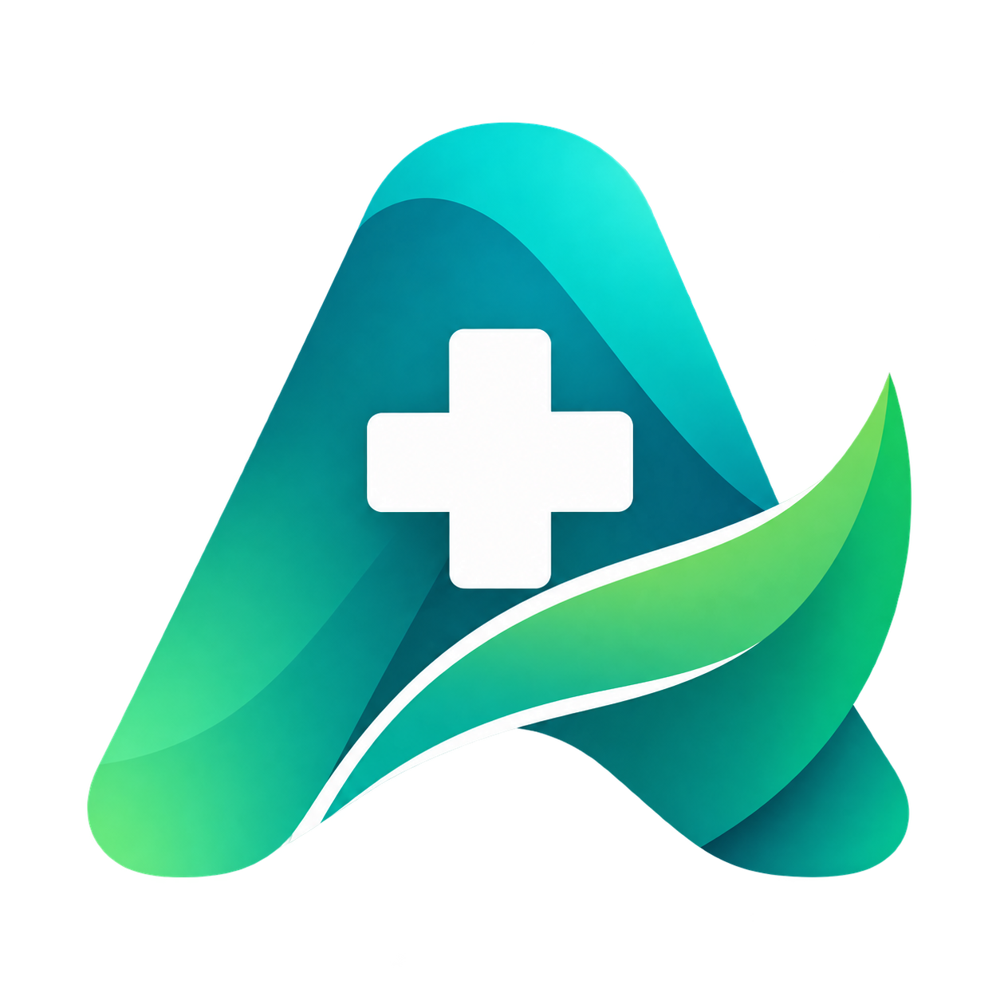
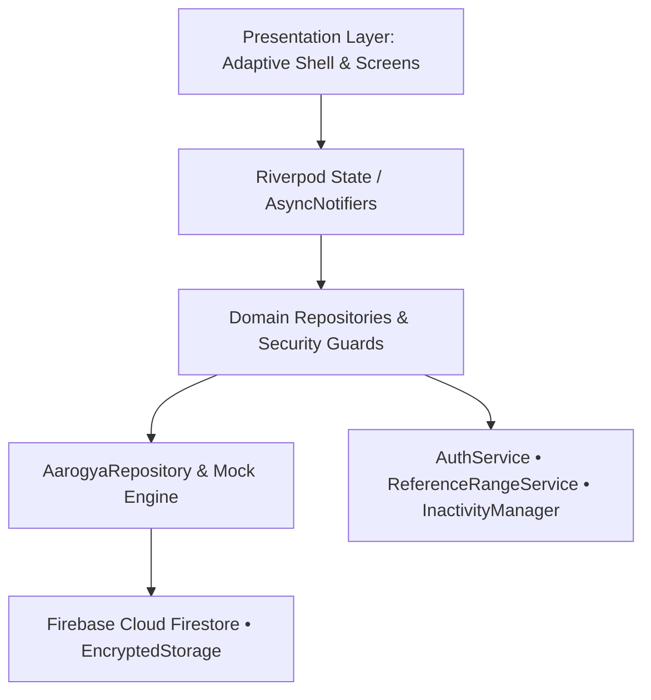

# Aarogya (आरोग्य) • Clinical Intelligence OS & Healthcare Platform

<p align="center">
  
</p>

<p align="center">
  <strong>A mission-critical, enterprise healthcare operating system built with Flutter & Firebase.</strong><br>
  Engineered with Clean Architecture, strict DPDP Act 2023 compliance, real-time clinical telemetry, and multi-role adaptive workflows.
</p>

<p align="center">
  <a href="#key-features"></a>
  <a href="#architecture"></a>
  <a href="#compliance"></a>
  <a href="#deployment"></a>
  <a href="#platforms"></a>
  <a href="https://omkar-anarse.vercel.app"></a>
</p>

---

## 📑 Table of Contents

- [Executive Overview](#-executive-overview)
- [Author & Creator](#-author--creator)
- [System Architecture](#-system-architecture)
- [Core Clinical Workspaces](#-core-clinical-workspaces)
- [Clinical Data Integrity & Security Standards](#-clinical-data-integrity--security-standards)
- [Design System & Clinical Craft](#-design-system--clinical-craft)
- [Project Structure](#-project-structure)
- [Quick Start & Local Development](#-quick-start--local-development)
- [Demo Personas & Credentials](#-demo-personas--credentials)
- [Verification & Quality Assurance](#-verification--quality-assurance)
- [Deployment Guide](#-deployment-guide)
- [License & Clinical Governance](#-license--clinical-governance)

---

## 🏥 Executive Overview

**Aarogya** is a unified clinical operating system designed to eliminate workflow fragmentation in modern healthcare facilities. It brings **Patients**, **Attending Physicians**, and **Hospital Administrators** into a single cohesive, reactive environment.

Built from the ground up to solve real-world healthcare delivery friction, Aarogya features:
- **Instant OPD Patient Triage & Consultations**: Live queue management with real-time token dispatch.
- **Diagnostic Reference Engine**: Continuous custom-painted reference range gauges with automated abnormal value caret flags.
- **ABDM / ABHA Interoperability**: Longitudinal health records, FHIR-aligned data structures, and digital prescriptions.
- **Zero-Latency Universal Omnibar**: `Cmd+K` global command palette for medical records, doctors, patients, diagnostic labs, and role routing.

---

## 👨‍💻 Author & Creator

<p align="center">
  <a href="https://omkar-anarse.vercel.app" target="_blank">
    
  </a>
</p>

<p align="center">
  <strong>Omkar Anarse</strong><br>
  <em>AI & Full Stack Engineer</em><br>
  🌐 <strong>Portfolio</strong>: <a href="https://omkar-anarse.vercel.app">https://omkar-anarse.vercel.app</a>
</p>

Aarogya includes a built-in interactive **"Produced by Omkar"** floating widget ([`OmkarPortfolioBadge`](lib/core/design_system/components/omkar_portfolio_badge.dart)) positioned in the bottom-right corner:
- **Pulsing Halo Avatar**: 3D cartoon avatar with an ambient breathing cyan/indigo radial glow and live online indicator.
- **Glassmorphic Brand Pill**: Modern capsule badge displaying `PRODUCED BY Omkar Anarse` with sparkle icon.
- **Speech Bubble Popover**: Responsive pop message (*"Hey! I'm Omkar Anarse 👋 AI & Full Stack Engineer. Click me to explore my portfolio!"*) with a one-tap direct CTA button.
- **Universal Floating Shell**: Globally mounted via `MaterialApp.builder` to float across all screens and consultation rooms.

---

## 🏛 System Architecture

Aarogya adopts **Clean Architecture** combined with **Riverpod 2.5 Reactive State Notifiers** (`AsyncNotifier`, `ChangeNotifierProvider`, `StateProvider`).



### Key Architectural Tenets:
1. **Unidirectional Data Flow**: State is immutably projected through Riverpod providers. UI components never mutate business state directly.
2. **Fail-Closed Patient Boundary Isolation**: Repository requests validate against an immutable `PatientSession`. Any cross-patient record access triggers an instant fail-closed `PatientMismatchException`.
3. **Integer Currency Arithmetic (`paise`)**: All invoices, payments, and financial calculations operate exclusively on 64-bit integer `paise` (1 INR = 100 paise) to eliminate floating-point IEEE 754 precision drift.
4. **Canonical UTC Provenance**: All clinical encounters, vitals telemetry, and lab results enforce strict UTC timestamps (`occurredAt`) with provenance tracking.

---

## 🎯 Core Clinical Workspaces

The application adapts dynamically to the active session persona:

### 1. Patient Portal
* **Health Dashboard**: Real-time vitals monitoring (Heart Rate, SpO2, Blood Pressure, Glucose) with trend indicators.
* **OPD Appointment Hub**: Live queue integration, token ETA tracking, and self-service booking.
* **Smart Rx & Prescriptions**: Dynamic medication adherence timeline (`active`, `completed`, `discontinued`).
* **Diagnostic Labs**: Comprehensive test panels with continuous normal/critical range gauges.
* **Digital Invoices & UPI Checkout**: Itemized billing with one-tap digital receipt generation.

### 2. Doctor Workspace
* **Live OPD Queue Manager**: Status transitions (`waiting`, `triage`, `consulting`, `completed`) with priority escalation.
* **Clinical Consultation Builder**: Chief complaints, physical exam findings, SOAP notes, and differential diagnoses.
* **Rx Prescription Writer**: Integrated drug database, dosage calculators, frequencies, and duration rules.
* **Longitudinal Patient History**: Chronological encounter timeline with cross-encounter diagnostic comparisons.

### 3. Hospital Admin Command Center
* **Inpatient Bed Occupancy**: Real-time ward breakdown (ICU, General Ward, Emergency, HDU, Private Suites).
* **Throughput & Capacity Analytics**: Departmental utilization, admission rates, and discharge bottlenecks.
* **Staff Duty Rosters**: Shift management and doctor on-duty status.
* **Revenue & Claims Pipeline**: Financial overview with insurance claim tracking and cashflow metrics.

### 4. Aarogya Omnibar (`Cmd+K` / `Ctrl+K`)
* Global modal palette with instant typeahead across doctors, patients, diagnostic lab tests, invoices, and role-switching navigation shortcuts.

---

## 🛡 Clinical Data Integrity & Security Standards

### DPDP Act 2023 & HIPAA Compliance Architecture

| Security Layer | Implementation Detail |
| :--- | :--- |
| **Data Minimization** | Ephemeral, time-limited signed tokens (15 min) for medical document viewing. |
| **PHI Scrubbing** | `ClinicalLogger` automatically redacts ABHA, Aadhaar, Phone, Email, and MRN before logging. |
| **Session Inactivity Guard** | Automatic 15-minute idle timeout with biometric duty re-authentication (`local_auth`). |
| **App Privacy Shield** | `AarogyaPrivacyShield` blanks out sensitive clinical screens when OS multitasking is triggered. |
| **Token Cryptography** | `EncryptedTokenStorage` safeguards auth tokens and session keys. |

---

## 🎨 Design System & Clinical Craft

The UI leverages a bespoke medical design system engineered for high-stress clinical environments:

- **Tokens as `ThemeExtension`**: Full support for light and dark glassmorphic themes with smooth `lerp()` transitions.
- **Continuous Diagnostic Gauge (`ReferenceGaugePainter`)**:
  - Replaces stepped bars with a gradient gauge mapping **Low**, **Normal (Safe Zone)**, and **High** ranges.
  - Out-of-bounds indicators (`▸`, `◂`) highlight critical lab thresholds.
  - Full screen reader semantics for WCAG AAA accessibility.
- **Tabular Figures (`FontFeature.tabularFigures()`)**:
  - All numerical telemetry, vitals, timecodes, and billing amounts use monospaced numeric glyphs to eliminate visual layout jitter.
- **Dynamic Text Resilience**:
  - All critical cards and KPI metrics are resilient to dynamic OS font scaling up to **2.0x**.
- **Interactive Portfolio Overlay (`OmkarPortfolioBadge`)**:
  - Seamless floating badge featuring Omkar Anarse's 3D avatar, ambient breathing glow, dismissable speech bubble popover, and external portfolio redirection.

---

## 📂 Project Structure

```text
lib/
├── app/
│   ├── shell/                # AdaptiveShell, Responsive layouts & Navigation
│   └── theme/                # AarogyaTheme & ThemeExtensions (Color/Typography tokens)
├── core/
│   ├── auth/                 # AuthService, Firebase Auth, Session handling
│   ├── clinical/             # ReferenceRangeService, diagnostic engines
│   ├── design_system/        # Reusable design tokens, buttons, cards, skeletons, OmkarPortfolioBadge
│   └── utils/                # Formatters, Currency (paise), Date utilities
├── features/
│   ├── auth/                 # Role-based onboarding, demo login & OTP verification
│   ├── patient/              # Dashboard, Appointments, Prescriptions, Labs
│   ├── doctor/               # OPD Queue, Clinical Workspace, Consultation builder
│   ├── admin/                # Bed Occupancy, Hospital Command Center, Analytics
│   └── billing/              # Invoices, Payments, Receipts
└── shared/
    ├── components/           # AarogyaOmnibar, GlassContainer, PrivacyShield
    ├── data/repositories/    # AarogyaRepository, Mock data, Domain repos
    ├── domain/models/        # Immutable domain entities (Patient, Doctor, LabReport, etc.)
    └── state/                # Riverpod Providers & AsyncNotifiers
```

---

## 🚀 Quick Start & Local Development

### Prerequisites

- **Flutter SDK**: `>= 3.13.1` ([Install Flutter](https://docs.flutter.dev/get-started/install))
- **Dart SDK**: `>= 3.1.0`
- **Node.js & Firebase CLI** *(optional, for deployment)*: `npm install -g firebase-tools`

### 1. Clone the Repository
```bash
git clone https://github.com/omkaranarse/Aarogya.git
cd Aarogya
```

### 2. Install Dependencies
```bash
flutter pub get
```

### 3. Launch the Application

#### Web (Chrome - Recommended for development)
```bash
flutter run -d chrome
```

#### macOS Desktop
```bash
flutter run -d macos
```

#### Mobile (iOS / Android)
```bash
flutter run
```

---

## 👥 Demo Personas & Credentials

For rapid clinical evaluation without configuring external auth providers, instant demo personas are pre-configured:

| Role | Persona Name | Default ID | Primary Workspace |
| :--- | :--- | :--- | :--- |
| **Patient** | Omkar Anarse / Rajesh Verma | `pat-1` | Health Summary, Telemetry, Prescriptions |
| **Doctor** | Dr. Priya Sharma | `doc-1` | Live OPD Triage, Clinical Consultation Workspace |
| **Admin** | Col. Sanjeev Nair | `admin-1` | Hospital Inpatient Command Center |

> **Tip**: In development mode (`kDebugMode`), use the **Role Switcher pill** in the top-right app header or press `Cmd+K` in the Omnibar to instantly switch roles on the fly.

---

## 🧪 Verification & Quality Assurance

Run the comprehensive clinical test suite:

```bash
# Run all unit, widget, and domain security tests
flutter test

# Run specific P0 data integrity and patient isolation audit tests
flutter test test/audit_p0_integrity_test.dart

# Analyze code quality and lint rules
flutter analyze
```

---

## 🌐 Deployment Guide

### Deploying to Firebase Hosting (100% Free Tier)

This project includes pre-configured [`firebase.json`](firebase.json) with optimized cache headers for CanvasKit and static assets:

1. **Build the production web bundle:**
   ```bash
   flutter build web --release
   ```

2. **Deploy to Firebase:**
   ```bash
   firebase login
   firebase deploy --only hosting
   ```
   Your app will be live at `https://aarogya-5abf6.web.app`.

### Deploying to Vercel / Netlify
1. Run `flutter build web --release`
2. Point your deployment root to `build/web`
3. Add single-page application rewrite rule (`/* -> /index.html`)

---

## 📜 License & Clinical Governance

Distributed under the **MIT License**. See `LICENSE` for more information.

> **Disclaimer**: Aarogya is designed as a clinical decision support and hospital management system. All automated scoring algorithms and reference ranges are subject to local hospital clinical governance protocols and physician oversight.
